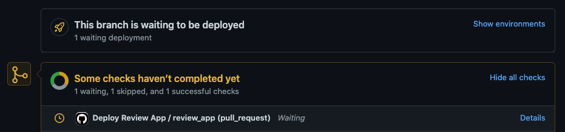
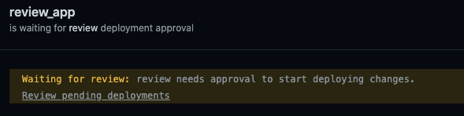
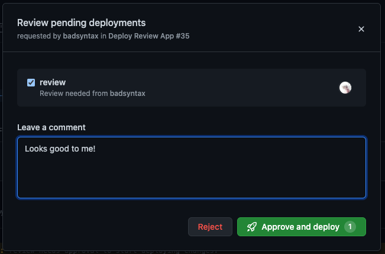
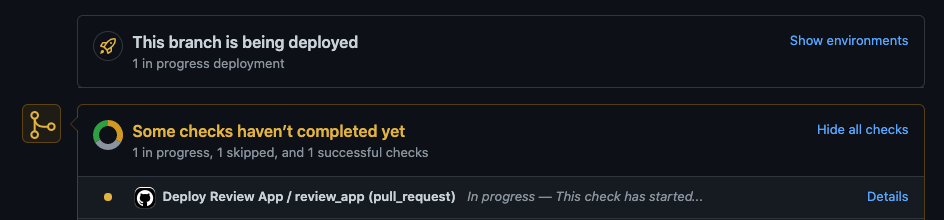
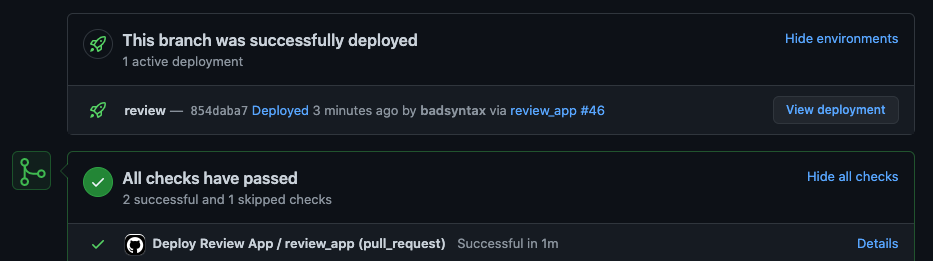

# Dokku GitHub Action Example

How to use the official [dokku GitHub action](https://github.com/dokku/github-action) to deploy your app using continuous delivery with GitHub Actions and GitHub Deploys.

GitHub Deploys is still in public beta but it's stablish and is a useful mechanism to manage your deployment workflows. You can use [environment protection rules](https://docs.github.com/en/actions/reference/environments#environment-protection-rules) to give you granular control over [who can deploy](https://docs.github.com/en/actions/managing-workflow-runs/reviewing-deployments) and to where.

## Workflows

This repository demonstrates how to:

- Deploy `review` apps to a `review` environment when a pull request is created or updated.
- Deploy a `production` app to a `production` environment on changes to the main/master branch.

You'll need to create the following following environments in the repository settings:

- production
- review

Take advantage of the [environment protection rules](https://docs.github.com/en/actions/reference/environments#environment-protection-rules) to enable deploy restrictions.

### Review Apps

Each time a pull request is opened or updated a new review app is deployed to url `http://github-actions-demo-app-${{ github.event.pull_request.number }}.dokku.proxima-web.com`.

#### Screenshots

The following screenshots shows the deploy workflow when the `review` environment requires reviewers:

##### Pull request created, but deploy is awaiting approval

##### GitHub Actions deploy workflow awaiting approval

##### Approving the deploy workflow

##### Deployment in progress

##### Deployment successful

### Production App

Each time the main/master branch is created or updated a new production app is deployed to `http://github-actions-demo-app.dokku.proxima-web.com`.
